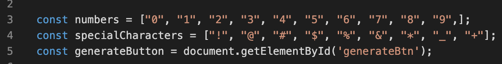
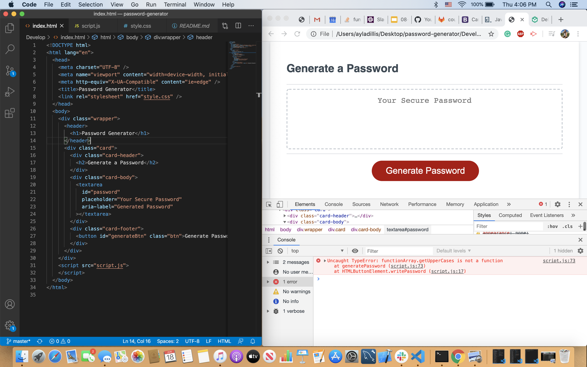

# Password-Generator
## Criteria 
    GIVEN I need a new, secure password
    WHEN I click the button to generate a password
    THEN I am presented with a series of prompts for password criteria
    WHEN prompted for password criteria
    THEN I select which criteria to include in the password
    WHEN prompted for the length of the password
    THEN I choose a length of at least 8 characters and no more than 128 characters
    WHEN prompted for character types to include in the password
    THEN I choose lowercase, uppercase, numeric, and/or special characters
    WHEN I answer each prompt
    THEN my input should be validated and at least one character type should be selected
    WHEN all prompts are answered
    THEN a password is generated that matches the selected criteria
    WHEN the password is generated
    THEN the password is either displayed in an alert or written to the page

## Technologies Used 

- JavaScript - used to activate the alert windows and generate the random password characters. 
- VS Code - where I wrote out my code
- GitHub - Used to generate the repository and publish the website.

## Tools Used 

- Slack
- w3School 
- SlackOverflow
- My peers
- Gitlab 
- Google 

## Screenshots 

- My tutor helped me set up some of the variables for my code as well as explaied to me how to sudocode out what I needed to do, he was a great resource. 

- I used the inspect element side-by-side with my code inorder to debug it (there were lots of bugs). 

## Code Snippets 

To be honest I had a lot of trouble with this homework and hit plenty of walls! However I'm excited for the challenge, if the Bootcamp was easy it wouldn't be worth taking, the following code is what I was able to understand the fullest.

function generatePassword() {
    var passwordLength = prompt("Please enter the number of characters you want for your new password. It must be no less than 8 and no more than 128.");

    var numbers = confirm("Do you want numbers in your password?");

    var lowerCases = confirm("Do you want lowercases in your password?");

    var upperCases = confirm("Do you want uppercases in your password?");

    var specialCharacters = confirm("Do you want special characters in your password?");

    var minimumCount =0; 

## Deploy Link

- [Click to See Live Site](https://github.com/ayladillis/password-generator)
- [Click to See Repository](https://ayladillis.github.io/password-generator/)

## Authors
Ayla Dillis 

- [HTML](https://developer.mozilla.org/en-US/docs/Web/HTML)
- [CSS](https://developer.mozilla.org/en-US/docs/Web/CSS)
- [Javascript](https://developer.mozilla.org/en-US/docs/Web/JavaScrip)