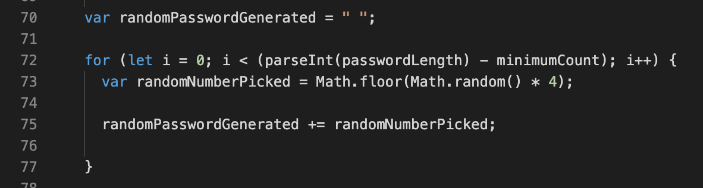

# Password-Generator
This application uses javascript to prompt users with a series of questions regarding their password; length (between 8 and 128 characters), lowercase, uppercase, numeric and/or special characters. Then generates a random password based on the users input. 


## Table of Content
- Objective
- Deploy Link
- Getting Started
- Code Highlights
- Author 

# Objective 
Using javascript generate prompts for the user to answer the following boolean questions after the 'generate password' button is clicked; 
Do you want numbers in your password?
Do you want lowercases in your password?
Do you want uppercases in your password?
Do you want special characters in your password?
Then have the password displayed.

## Deploy Link
* [See Live Link](https://ayladillis.github.io/password-generator/)

## Getting Started 
These instructions will get you a copy of the project up and running on your local machine for development and testing purposes. See deployment for notes on how to deploy the project on a live system.

```
$ git clone git@github.com:ayladillis/password-generator.git
password-generator.git
$ cd password-generator.git
```
Then open in your preferred text editor:
- [vim](https://www.vim.org/) 
- [emmacs](https://www.gnu.org/software/emacs/)
- [visual studio code](https://code.visualstudio.com/) 

## Code Highlights
Variables defining the array of numbers and special charachters as well as a getElementById attachted to the generate button so it can exicute its function. 


The for loop function that builds the random pasword from the users answers to the questions, random numbers picked. 



## Technology 
* [HTML](https://developer.mozilla.org/en-US/docs/Web/HTML)
* [CSS](https://developer.mozilla.org/en-US/docs/Web/CSS)
* [Javascript](https://developer.mozilla.org/en-US/docs/Web/JavaScrip)
* [JQuery](https://jquery.com/)

## Authors 
- [Ayla Dillis](https://github.com/ayladillis)